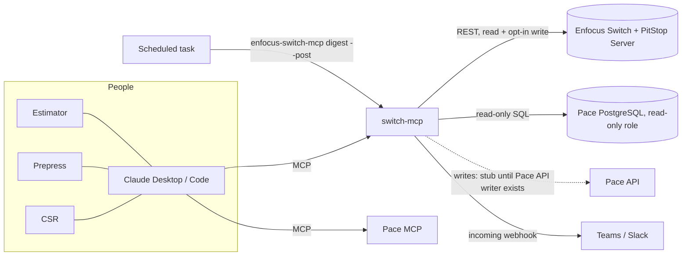

# AI connector for Enfocus Switch: research notes and roadmap

This document explains what an AI assistant can do safely with Enfocus Switch, why it's
built as an MCP server, and where it could go next. The first version is in
[`switch-mcp/`](../switch-mcp).

## 1. What Switch exposes

**Switch Web Services REST API** (port 51088 by default; reference:
[v24 API docs](https://www.enfocus.com/manuals/DeveloperGuide/WebServices/24/index.html)).

| Area | Endpoints | Useful for |
|---|---|---|
| Auth | `POST /login` (RSA-encrypted password, `!@$` + base64), `GET /logout`, `GET /api/v1/ping` | Session management |
| Flows | `GET /api/v1/flows`, `PUT /flows/:id?action=start\|stop`, flow annotations CRUD | Status, start/stop, documentation |
| Submit points | `GET /api/v1/submitpoints[/:flow-object]` including metadata field definitions (enum, regex, dependencies) | Structured job intake |
| Jobs | `POST /api/v1/job` (multipart submit), `GET /api/v1/jobs` (rich JSON filter, sort, `lastUpdated` polling), `GET /job/:id` (download), `GET /job/report/:id`, `GET /job/metadata`, `PUT /job/:id?action=route\|replace\|lock\|unlock` | Tracking, approvals, proof replacement |
| Processing | `PUT /api/v1/processingjob/:processingId?action=rush\|unrush` | Priority |
| Messages | `GET /api/v1/messages` (period, type, flow, job filters), saved message filters | Troubleshooting |
| Reporting | `POST /api/v1/graphql` (processing jobs; statistics with Reporting module) | Dashboards, SLA analysis |
| Other | `GET /api/v1/thumbnails`, job filters CRUD, user groups | Previews, saved views |

Practical notes:

- Production use needs the **Web Services module**. Without it Switch limits API calls
  ("API limit reached").
- Links returned for downloads and reports embed Switch's own host name (often `127.0.0.1`).
  The connector rewrites them to the configured URL.
- The **checkpoint** is where AI help pays off most. A job waiting there has a status of
  `alert`. The job carries `outConnections` (e.g. Approve/Reject), optional checkpoint
  metadata, and optionally a viewable report.

**Other integration points (not used yet):**

- *Switch Scripter / scripting API (Node.js, TypeScript).* A custom flow element could call an
  LLM inside the flow, e.g. classify incoming files or write the customer message directly
  into job metadata. This runs inside Switch, not from the assistant.
- *PitStop Server CLI / PitStop Library Container.* These run preflight directly and give XML
  or JSON reports. This path suits a stand-alone "preflight as a service".
- *Switch HTTP Request / Webhook elements.* Switch can push events (job arrived in checkpoint)
  to a small service. That service can pre-compute the plain-language report so it's ready
  before anyone asks.

## 2. PitStop report formats (for plain-language explanations)

| Format | Shape | Notes |
|---|---|---|
| XML v2 (PitStop 10.1+) | `EnfocusReport/Report/PreflightResult/PreflightResultEntry[@level]` | Counts are attributes on `PreflightResult`. The message is in `PreflightResultEntryMessage/Message` |
| XML v3 (PitStop 2018+) | `EnfocusReport/PreflightReport/{Errors,Warnings,Fixes,Signoffs,...}/PreflightReportItem` | Items have `Message`, `StringContext/BaseString`, and `Location@page` (0-based) |
| JSON (PitStop 2023+) | `preflightReport.{errors,warnings,fixes}.preflightReportItem[]` plus `processInfo`, `generalDocInfo`, `pageBoxInfo`, ... | Richest metadata |
| PDF | Human-readable report | Handled by text extraction. Less precise |

In every format, messages end with an occurrence suffix such as `(3x on pages 1, 2)`. The
parser splits that suffix into counts and pages. Enfocus does not publish an XSD for the
report. The parser was written against real fragments and matches element names without
namespaces. **Next step: validate it against real reports from our PitStop Server** and add
them as test fixtures.

**Recommendation for the flows:** have each PitStop Server element write an **XML v3 (or
JSON) report** alongside the PDF report, and attach it to the job when it reaches the
checkpoint.

## 3. Automation opportunities

Each idea below has a **status**:

| Status | Meaning |
|---|---|
| **Built** | Working and tested in `switch-mcp`; needs only configuration and live validation |
| **Scaffolded** | Code, config and tests exist; one clearly marked piece (usually a Pace write or a query) is left for the team |
| **Design** | Written up here with the building blocks it would use; no dedicated code yet |

### How the pieces fit

There are two ways Pace data reaches Claude, and both are supported:

- **Pace MCP + switch-mcp side by side.** Claude reads the job from the Pace MCP and passes the details to
  a switch-mcp tool, for example `compare_file_to_ticket(trim=…, colors=…)`. This needs no configuration in
  switch-mcp. The MCP prompts `check_file_against_ticket` and `quote_from_file` are written for this.
- **switch-mcp's own read-only Pace gateway** (`automation/pace.py`). Needed for unattended automation
  (digest, webhooks) and for one-call tools such as `compare_file_to_ticket(pace_job_number=…)`. It reads
  through SQL you write in `pace_queries.sql`, on a read-only role, inside a read-only transaction.

### Client services

#### A1. Plain-language preflight explanations: **Built**
- **Problem:** PitStop reports are written for prepress. CSRs retype them into emails, and customers don't understand them.
- **How:** The PitStop report (XML v2/v3, JSON or PDF) is grouped into about 18 issue categories. The result has
  a verdict (`ready` / `prepress_can_fix` / `needs_customer`), who owns each fix, and a write-up for the customer,
  the CSR or prepress.
- **Where:** `preflight.py`, `knowledge.py`; tools `explain_job_report` and `explain_preflight_report`; prompt `customer_preflight_email`.
- **Next:** Validate against real reports. Tune the wording and fix owners in `knowledge.py` to house policy.

#### A2. Client self-serve preflight: **Design** (building blocks built)
- **Problem:** Bad files are found hours after upload, sometimes after the job is scheduled.
- **How:**
  1. The web-to-print portal posts the upload to a small internal service.
  2. The service runs the quick checks straight away: `pdf_check.check_pdf` and `ticket_check.compare` against
     the order options (size, colors, pages).
  3. It returns the customer write-up from `preflight.render(..., "customer")` within seconds.
  4. In parallel it submits the file to a "Client Preflight" Switch submit point. PitStop runs the full profile,
     and the explained report is sent to the client when it's ready.
- **Building blocks:** `quick_check_pdf`, `compare_file_to_ticket`, `explain_job_report`, prompt `client_preflight_reply`.
- **To build:** A thin HTTP service (not the MCP server) behind the portal. It must:
  - use the portal's own authentication
  - cap upload sizes
  - use a dedicated Switch submit point
  - never give clients Claude access directly
- **Guardrails:** The deterministic write-ups need no LLM in the path. If an LLM rewrites the text, a CSR reviews
  it before it's sent.

#### A3. Customer messages saved to Pace: **Scaffolded**
- **How:** The explanation for a checkpoint job becomes a Pace job note, so every CSR sees the same text.
- **Where:** `PaceGateway.add_job_note`. The writer is a stub (`PaceApiWriter`) until it's implemented with the Pace API.
- **Next (Pace team):** Implement `PaceApiWriter.add_job_note` with the Pace API. Until then, the tools return the
  note text to paste in.

#### A4. "Where's my job?": **Built** (Switch side), **Scaffolded** (Pace side)
- **How:** `find_jobs` / `find_job_numbers` give where the job is in Switch. `pace_job` gives the Pace status,
  due date and CSR. The prompt `csr_order_status` combines them into what to tell the customer.
- **Next:** Fill in the `job_status` query in `pace_queries.sql`.

#### A5. Proof approval that closes the loop: **Scaffolded**
- **Problem:** Approvals arrive by email or phone. Someone routes the Switch job, someone else updates Pace, and
  steps get missed.
- **How:** `approve_proof(job_id, approved_by, pace_job_number)`:
  1. Route the Switch job via the `SWITCH_APPROVE_CONNECTION` connection. This is real and working.
  2. Set the Pace status to `PACE_PROOF_APPROVED_STATUS`.
  3. Add a Pace note saying who approved and when.
- It defaults to a **dry run** that shows the plan. Pace steps come back as `manual`, with instructions, until
  the Pace writer exists.
- **Where:** `automation/workflows.py`; tool `approve_proof`, which needs `SWITCH_ALLOW_WRITE=true`.
- **Next:**
  - Implement `PaceApiWriter.update_job_status` and `PaceApiWriter.add_job_note`.
  - Decide the exact status name.
  - Later: trigger it from the portal's "Approve" button through the A2 service instead of by hand.

### Prepress

#### B1. File vs. job ticket check: **Built** (Pace lookup scaffolded)
- **Problem:** Wrong size, page count or colors are found at plating, or on press.
- **How:** `pdf_facts` measures each page:
  - trim size and bleed
  - the process inks actually painted (C, M, Y, K)
  - RGB content
  - spot colors, including escaped PDF names

  `ticket_check.compare` compares these with a `JobSpec` (size, pages, colors such as "4/4 + PMS 185 C",
  binding, bleed) and returns `matches_ticket` / `check_with_customer` / `does_not_match`. Each mismatch comes
  with a plain sentence for the CSR, for example: "Page 1 is full color but the order is 1/1".
- **Where:** `automation/pdf_facts.py`, `specs.py`, `ticket_check.py`; tools `compare_file_to_ticket` and `pdf_facts`.
- **Next:**
  - Fill in the `job_spec` query so `pace_job_number=` works in one call. Or use it with the Pace MCP today.
  - Tune `SIZE_TOLERANCE_IN`.
  - Later: run it automatically in a Switch flow (a script element calling the same code) before PitStop.
- **Limits:** It doesn't measure ink coverage or colors inside shadings/patterns; PitStop covers those.

#### B2. Auto-fix routing: **Built** (needs your map and a Switch branch)
- **How:** `SWITCH_AUTOFIX_MAP` says which issue categories your flow fixes automatically, and through which
  checkpoint connection and PitStop Action List. `plan_autofixes(job_id)` splits a job's issues into:
  - auto-fixable
  - prepress by hand
  - customer

  It then suggests the next routing step, for example "route via 'Auto-fix'".
- **Where:** `automation/autofix.py`, `autofix_map.example.json`; tool `plan_autofixes`.
- **Next (Switch team):**
  1. Build an "Auto-fix" branch after the preflight checkpoint (PitStop Action Lists, then preflight again).
  2. Fill in the map.
  3. Later: route automatically when the plan says every issue is auto-fixable.

#### B3. Morning digest and stuck-job alerts: **Built**
- **How:** The digest lists:
  - jobs waiting in checkpoints, flagging those waiting longer than `DIGEST_STUCK_HOURS`
  - flows that aren't running
  - recurring errors grouped by flow and element

  `enfocus-switch-mcp digest --post` sends it to a Teams/Slack incoming webhook.
- **Where:** `automation/digest.py`; tool `morning_digest`; CLI `digest`.
- **Next:** Schedule it: cron / Task Scheduler at 7:00 on a machine with the connector configured.
- **Later:** Near-real-time alerts. A Switch HTTP-request element posts "job arrived in checkpoint" to a small
  service, which calls the same code.

#### B4. Match incoming files and emails to jobs: **Built** (Pace lookup scaffolded)
- **How:** `find_job_numbers(text)` finds job numbers in file names and emails using `PACE_JOB_NUMBER_PATTERNS`.
  With Pace connected, it also looks up each candidate.
- **Next:** Set the patterns to Drummond's job number format.
- **Later:** Use it in a hot-folder or email-intake flow to attach the job number as Switch metadata automatically.

### Estimating

#### C1. Draft an estimate from a print file: **Built** (Pace item creation scaffolded)
- **How:** `draft_item_from_pdf` reads the file and returns:
  - finished size and the matching standard product (business card, postcard, flyer, booklet...)
  - pages, sides and inks per side
  - spot colors, bleed and a binding guess
  - a confidence rating
  - what is still needed from the customer (quantity, stock, finishing, dates)
  - a **Pace item-template payload** mapped through `PACE_ITEM_TEMPLATE_MAP`
- **Where:** `automation/estimate_draft.py`, `item_template_map.example.json`; tool `draft_item_from_pdf`;
  prompt `quote_from_file`.
- **Next:**
  - Put the real item-template field names in the map.
  - Add house products to `STANDARD_PRODUCTS`.
  - Estimators enter the payload in Pace (by hand or with the Pace MCP) until an API writer creates items directly.
- **Guardrail:** It never prices anything. Pricing stays in Pace, done by a person.

#### C2. RFQ email to estimate request: **Design** (prompt built)
- **How:** The `rfq_to_estimate` prompt extracts specs from a request for quote: quantities, size, colors,
  stock, finishing, dates. It marks what's missing and drafts the questions to send back.
- **Next:** Connect the estimating mailbox with the Microsoft 365 connector so Claude can read RFQs. Normalize
  the output into `JobSpec` so it can go into C1 and C3.

#### C3. Similar-job lookup: **Scaffolded**
- **How:** The `similar_jobs` query finds recent jobs with the same size and pages. `draft_item_from_pdf` lists
  them as a pricing sanity check.
- **Next:** Write the `similar_jobs` SQL, for example matching size and pages within the last 12 months, and
  including price and quantity.

### Workflow and reporting

#### D1. Switch ↔ Pace status sync: **Design**
- **How:**
  - Switch milestones (prepress started, proof sent, approved, plated) post to a small service, via the Switch
    HTTP element or a script element.
  - The service calls `PaceGateway.update_job_status` for each milestone.
  - In the other direction, Pace job changes such as cancel or hold can lock the Switch job (`set_job_lock`).
- **Needs:**
  - the Pace API writer
  - a mapping of Switch flow stages to Pace statuses
  - an allow-list of statuses the automation may set

#### D2. Analytics: **Design**
- **Ideas:**
  - Preflight failure rate by customer and issue type, to target client education such as sending our PDF
    export guide.
  - Time spent in checkpoints against turnaround targets.
  - Proof rounds per job.
- **How:** Log each analysis (verdict and categories, no file contents) with the Pace customer, and query the
  Switch Reporting module with `graphql_query`.
- **Needs:** a small table, for example in a reporting schema, and a decision on retention.

#### D3. Customer-specific rules: **Design**
- **Example:** A customer who always accepts low-resolution images at their own risk. Their verdicts should
  come back as `ready` with a note instead of `needs_customer`.
- **How:** Store per-customer overrides next to Pace customer records and apply them in `preflight.analyze`.

### Suggested order

1. **Live validation of what's built:**
   - Switch user and `check`
   - real PitStop reports
   - write actions on a test flow
2. **Pace, read-only:**
   - Fill in `pace_queries.sql` (job_spec, job_status, similar_jobs).
   - Turn on B1, A4, B4 and C3 in one call each.
3. **Quick wins:**
   - Schedule the digest (B3).
   - Build the auto-fix branch and map (B2).
   - Set job number patterns (B4).
4. **Pace writes:**
   - Implement `PaceApiWriter` with the Pace API and a status allow-list.
   - Turn on A3, A5 and D1.
5. **Client-facing:**
   - Self-serve preflight service (A2).
   - Portal-driven proof approval.
6. **Estimating depth and analytics:** C1 → C2 → D2.

### Guardrails for all of these

- **Pace data access:**
  - Read-only database access only: a read-only role, a read-only transaction, SELECT/WITH only, a statement timeout.
  - Pace writes go only through the Pace API, behind an allow-list. Never write SQL against the Pace database.
- **Changes in Switch:**
  - Every workflow that changes something has a dry run.
  - Every change is logged under the connector's own Switch user.
- **Human approval:** Anything customer-facing, anything that sets a price, and anything that changes production
  (routing, flow control) needs a person's approval.
- **Customer data:** Customer files and data go to Claude only under Drummond's Claude agreement. The client
  self-serve service (A2) must not give clients access to Claude or to internal systems.

## 4. Why MCP

- One connector works with Claude Desktop, Claude Code and any MCP-capable client. Later it
  can also run behind a web app or a Teams/Slack bot.
- Tools carry read-only / destructive annotations, so clients can require confirmation
  before an approval.
- Write tools are hidden unless explicitly enabled. By default the connector is read-only.

## 5. Safety

- Use a dedicated Switch user for the connector, with least privilege. Its actions show up
  in Switch under that name.
- Routing always passes the job's `updated` timestamp, so Switch rejects stale decisions.
- Local file access is limited to the allow-listed folders.
- Customer-facing text is drafted, never sent automatically. A human sends it.
- Credentials come from environment variables and are never logged. The password is
  RSA-encrypted before it goes over the wire, as Switch requires. Put the Switch API behind
  HTTPS when it is reached across the network.

## 6. Open questions for the shop

Pace:

- Which Pace version, and is there a read replica we can query with a read-only role?
- Who owns the Pace schema mapping for `pace_queries.sql` (job spec, status, similar jobs)?
- Which Pace API should writes use, and which statuses may automation set (the allow-list)?
- What is the exact Pace status for "proof approved"?

Switch and PitStop:

- Which Switch version and modules are licensed (Web Services, Reporting, PitStop Server)?
- What do our checkpoint connections and metadata fields look like? (Needed to tune the
  route and metadata helpers and the prompts.)
- Which fixes do we do in-house for free, and which do we charge for? (This sets
  `fix_owner` and the wording in `knowledge.py`.)
- Where should customer-facing text go: email, the web-to-print portal, or MIS notes?
