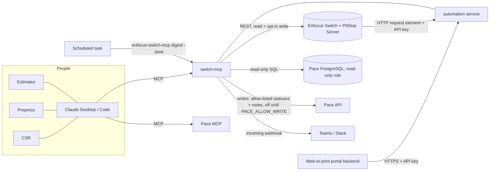

# AI connector for Enfocus Switch: research notes and roadmap

This document explains what an AI assistant can do safely with Enfocus Switch, why it's
built as an MCP server, and where it could go next. The first version is in
[`switch-mcp/`](../switch-mcp).

## 1. What Switch exposes

**Switch Web Services REST API** (port 51088 by default; reference:
[v24 API docs](https://www.enfocus.com/manuals/DeveloperGuide/WebServices/24/index.html)).

| Area | Endpoints | Useful for |
|---|---|---|
| Auth | `POST /login` (RSA-encrypted password, `!@$` + base64), `GET /logout`, `GET /api/v1/ping` | Session management |
| Flows | `GET /api/v1/flows`, `PUT /flows/:id?action=start\|stop`, flow annotations CRUD | Status, start/stop, documentation |
| Submit points | `GET /api/v1/submitpoints[/:flow-object]` including metadata field definitions (enum, regex, dependencies) | Structured job intake |
| Jobs | `POST /api/v1/job` (multipart submit), `GET /api/v1/jobs` (rich JSON filter, sort, `lastUpdated` polling), `GET /job/:id` (download), `GET /job/report/:id`, `GET /job/metadata`, `PUT /job/:id?action=route\|replace\|lock\|unlock` | Tracking, approvals, proof replacement |
| Processing | `PUT /api/v1/processingjob/:processingId?action=rush\|unrush` | Priority |
| Messages | `GET /api/v1/messages` (period, type, flow, job filters), saved message filters | Troubleshooting |
| Reporting | `POST /api/v1/graphql` (processing jobs; statistics with Reporting module) | Dashboards, SLA analysis |
| Other | `GET /api/v1/thumbnails`, job filters CRUD, user groups | Previews, saved views |

Practical notes:

- Production use needs the **Web Services module**. Without it Switch limits API calls
  ("API limit reached").
- Links returned for downloads and reports embed Switch's own host name (often `127.0.0.1`).
  The connector rewrites them to the configured URL.
- The **checkpoint** is where AI help pays off most. A job waiting there has a status of
  `alert`. The job carries `outConnections` (e.g. Approve/Reject), optional checkpoint
  metadata, and optionally a viewable report.

**Other integration points (not used yet):**

- *Switch Scripter / scripting API (Node.js, TypeScript).* A custom flow element could call an
  LLM inside the flow, e.g. classify incoming files or write the customer message directly
  into job metadata. This runs inside Switch, not from the assistant.
- *PitStop Server CLI / PitStop Library Container.* These run preflight directly and give XML
  or JSON reports. This path suits a stand-alone "preflight as a service".
- *Switch HTTP Request / Webhook elements.* Switch can push events (job arrived in checkpoint)
  to a small service. That service can pre-compute the plain-language report so it's ready
  before anyone asks.

## 2. PitStop report formats (for plain-language explanations)

| Format | Shape | Notes |
|---|---|---|
| XML v2 (PitStop 10.1+) | `EnfocusReport/Report/PreflightResult/PreflightResultEntry[@level]` | Counts are attributes on `PreflightResult`. The message is in `PreflightResultEntryMessage/Message` |
| XML v3 (PitStop 2018+) | `EnfocusReport/PreflightReport/{Errors,Warnings,Fixes,Signoffs,...}/PreflightReportItem` | Items have `Message`, `StringContext/BaseString`, and `Location@page` (0-based) |
| JSON (PitStop 2023+) | `preflightReport.{errors,warnings,fixes}.preflightReportItem[]` plus `processInfo`, `generalDocInfo`, `pageBoxInfo`, ... | Richest metadata |
| PDF | Human-readable report | Handled by text extraction. Less precise |

In every format, messages end with an occurrence suffix such as `(3x on pages 1, 2)`. The
parser splits that suffix into counts and pages. Enfocus does not publish an XSD for the
report. The parser was written against real fragments and matches element names without
namespaces. **Next step: validate it against real reports from our PitStop Server** and add
them as test fixtures.

**Recommendation for the flows:** have each PitStop Server element write an **XML v3 (or
JSON) report** alongside the PDF report, and attach it to the job when it reaches the
checkpoint.

## 3. Automation opportunities

Each idea below has a **status**:

| Status | Meaning |
|---|---|
| **Built** | Working and tested in `switch-mcp`; needs only configuration and live validation |
| **Built, needs config** | Code and tests are done; it needs a house-specific file (Pace SQL, Pace API endpoints, a map) before it can run |
| **Design** | Written up here with the building blocks it would use; no dedicated code yet |

The IT handoff package ([`handoff/`](handoff/README.md)) turns this into a deployable plan:
- component readiness
- deployment
- UAT
- rollout
- backlog
- training

### How the pieces fit

There are two ways Pace data reaches Claude, and both are supported:

- **Pace MCP + switch-mcp side by side.** Claude reads the job from the Pace MCP and passes the details to
  a switch-mcp tool, for example `compare_file_to_ticket(trim=…, colors=…)`. This needs no configuration in
  switch-mcp. The MCP prompts `check_file_against_ticket` and `quote_from_file` are written for this.
- **switch-mcp's own read-only Pace gateway** (`automation/pace.py`). Needed for unattended automation
  (digest, webhooks) and for one-call tools such as `compare_file_to_ticket(pace_job_number=…)`. It reads
  through SQL you write in `pace_queries.sql`, on a read-only role, inside a read-only transaction.

Writes to Pace go only through the Pace API (`PaceApiWriter`). The operations (endpoint, method, body
template) are configured in `pace_api.json` from the Pace API documentation. Writes are refused unless
`PACE_ALLOW_WRITE=true`, and statuses are refused unless they are in `PACE_ALLOWED_STATUSES`. Every
attempt is audited.

The **automation web service** (`enfocus-switch-mcp service`, `service.py`) runs the same code for callers
that aren't people using Claude: Switch flows and the portal. It needs scoped API keys, is dry-run by
default, and has no LLM in the path.

### Client services

#### A1. Plain-language preflight explanations: **Built**
- **Problem:** PitStop reports are written for prepress. CSRs retype them into emails, and customers don't understand them.
- **How:** The PitStop report (XML v2/v3, JSON or PDF) is grouped into about 18 issue categories. The result has
  a verdict (`ready` / `prepress_can_fix` / `needs_customer`), who owns each fix, and a write-up for the customer,
  the CSR or prepress.
- **Where:** `preflight.py`, `knowledge.py`; tools `explain_job_report` and `explain_preflight_report`; prompt `customer_preflight_email`.
- **Next:** Validate against real reports. Tune the wording and fix owners in `knowledge.py` to house policy.

#### A2. Client self-serve preflight: **Built** (portal integration and the full-PitStop submission left)
- **Problem:** Bad files are found hours after upload, sometimes after the job is scheduled.
- **How:**
  1. The web-to-print portal posts the upload to a small internal service.
  2. The service runs the quick checks straight away: `pdf_check.check_pdf` and `ticket_check.compare` against
     the order options (size, colors, pages).
  3. It returns the customer write-up from `preflight.render(..., "customer")` within seconds.
  4. In parallel it submits the file to a "Client Preflight" Switch submit point. PitStop runs the full profile,
     and the explained report is sent to the client when it's ready.
- **Where:** `service.py` `POST /preflight`, called by the portal **backend** with a `preflight`-scope key.
  It does steps 1–3, applies customer rules and records analytics. It only compares against a Pace job when
  that job belongs to the customer the portal names, so one customer can't see another's order.
- **Left (portal + Switch teams):**
  - Call the endpoint from the portal backend; never from the browser.
  - Show `message` to the customer.
  - Step 4: submit the file to the "Client Preflight" submit point. The events endpoint (`explain: true`)
    returns the explained PitStop report for the portal to show.
- **Guardrails:** The deterministic write-ups need no LLM in the path. If an LLM rewrites the text, a CSR reviews
  it before it's sent.

#### A3. Customer messages saved to Pace: **Built, needs config** (Pace API endpoints)
- **How:** The explanation for a checkpoint job becomes a Pace job note, so every CSR sees the same text.
- **Where:** `PaceApiWriter.add_job_note`, used by `approve_proof` and `/switch/events`; the events endpoint
  adds the preflight verdict to the note.
- **Next (Pace team):** Fill in `add_job_note` in `pace_api.json` from the Pace API documentation, test on a Pace
  test system, then set `PACE_ALLOW_WRITE=true`. Until then, the note text is returned as a manual step.

#### A4. "Where's my job?": **Built** (Switch side), **Built, needs config** (Pace side: `job_status` SQL)
- **How:** `find_jobs` / `find_job_numbers` give where the job is in Switch. `pace_job` gives the Pace status,
  due date and CSR. The prompt `csr_order_status` combines them into what to tell the customer.
- **Next:** Fill in the `job_status` query in `pace_queries.sql`.

#### A5. Proof approval that closes the loop: **Built, needs config** (Pace API endpoints)
- **Problem:** Approvals arrive by email or phone. Someone routes the Switch job, someone else updates Pace, and
  steps get missed.
- **How:** `approve_proof(job_id, approved_by, pace_job_number)`:
  1. Route the Switch job via the `SWITCH_APPROVE_CONNECTION` connection. This is real and working.
  2. Set the Pace status to `PACE_PROOF_APPROVED_STATUS`.
  3. Add a Pace note saying who approved and when.
- It defaults to a **dry run** that shows the plan. Pace steps come back as `manual`, with instructions, until
  Pace writes are configured and on.
- **Where:** `automation/workflows.py`. In Claude it is the tool `approve_proof`, which needs
  `SWITCH_ALLOW_WRITE=true`. Portals and Switch call `POST /proof/approve` (scope `proof_approve`) instead.
- **Next:**
  - Configure the Pace API operations (A3).
  - Decide the exact status name and put it in `PACE_ALLOWED_STATUSES`.
  - Wire the portal's "Approve" button to `/proof/approve`.

### Prepress

#### B1. File vs. job ticket check: **Built** (Pace lookup needs the `job_spec` SQL)
- **Problem:** Wrong size, page count or colors are found at plating, or on press.
- **How:** `pdf_facts` measures each page:
  - trim size and bleed
  - the process inks actually painted (C, M, Y, K)
  - RGB content
  - spot colors, including escaped PDF names

  `ticket_check.compare` compares these with a `JobSpec` (size, pages, colors such as "4/4 + PMS 185 C",
  binding, bleed) and returns `matches_ticket` / `check_with_customer` / `does_not_match`. Each mismatch comes
  with a plain sentence for the CSR, for example: "Page 1 is full color but the order is 1/1".
- **Where:** `automation/pdf_facts.py`, `specs.py`, `ticket_check.py`; tools `compare_file_to_ticket` and `pdf_facts`.
- **Next:**
  - Fill in the `job_spec` query so `pace_job_number=` works in one call. Or use it with the Pace MCP today.
  - Tune `SIZE_TOLERANCE_IN`.
  - Later: run it automatically in a Switch flow (a script element calling the same code) before PitStop.
- **Limits:** It doesn't measure ink coverage or colors inside shadings/patterns; PitStop covers those.

#### B2. Auto-fix routing: **Built** (needs your map and a Switch branch)
- **How:** `SWITCH_AUTOFIX_MAP` says which issue categories your flow fixes automatically, and through which
  checkpoint connection and PitStop Action List. `plan_autofixes(job_id)` splits a job's issues into:
  - auto-fixable
  - prepress by hand
  - customer

  It then suggests the next routing step, for example "route via 'Auto-fix'".
- **Where:** `automation/autofix.py`, `autofix_map.example.json`; tool `plan_autofixes`.
- **Next (Switch team):**
  1. Build an "Auto-fix" branch after the preflight checkpoint (PitStop Action Lists, then preflight again).
  2. Fill in the map.
  3. Automatic routing is built: the Switch event `preflight_done` with `auto_route: true`, plus
     `SERVICE_AUTO_ROUTE=true`, routes jobs whose open issues are all auto-fixable. Turn it on after UAT.

#### B3. Morning digest and stuck-job alerts: **Built**
- **How:** The digest lists:
  - jobs waiting in checkpoints, flagging those waiting longer than `DIGEST_STUCK_HOURS`
  - flows that aren't running
  - recurring errors grouped by flow and element

  `enfocus-switch-mcp digest --post` sends it to a Teams/Slack incoming webhook.
- **Where:** `automation/digest.py`; tool `morning_digest`; CLI `digest`.
- **Next:** Schedule it: cron / Task Scheduler at 7:00 on a machine with the connector configured.
- **Later:** Near-real-time alerts. The automation service already receives Switch events; posting an
  alert for chosen events to the webhook is a small addition (backlog).

#### B4. Match incoming files and emails to jobs: **Built** (Pace lookup needs the `job_status` SQL)
- **How:** `find_job_numbers(text)` finds job numbers in file names and emails using `PACE_JOB_NUMBER_PATTERNS`.
  With Pace connected, it also looks up each candidate.
- **Next:** Set the patterns to Drummond's job number format.
- **Unattended:** An intake flow calls `POST /switch/match-job` (scope `match_job`) with the file name or email
  subject. It gets back `job_number` when exactly one job matches, and `ambiguous: true` otherwise, so the flow
  can route those to a person.

### Estimating

#### C1. Draft an estimate from a print file: **Built** (creating the Pace item is still by hand)
- **How:** `draft_item_from_pdf` reads the file and returns:
  - finished size and the matching standard product (business card, postcard, flyer, booklet...)
  - pages, sides and inks per side
  - spot colors, bleed and a binding guess
  - a confidence rating
  - what is still needed from the customer (quantity, stock, finishing, dates)
  - a **Pace item-template payload** mapped through `PACE_ITEM_TEMPLATE_MAP`
- **Where:** `automation/estimate_draft.py`, `item_template_map.example.json`; tool `draft_item_from_pdf`;
  prompt `quote_from_file`.
- **Next:**
  - Put the real item-template field names in the map.
  - Add house products to `STANDARD_PRODUCTS`.
  - Estimators enter the payload in Pace (by hand or with the Pace MCP) until an API writer creates items directly.
- **Guardrail:** It never prices anything. Pricing stays in Pace, done by a person.

#### C2. RFQ email to estimate request: **Built** (mailbox connection left)
- **How:**
  1. The `rfq_to_estimate` prompt extracts specs from a request for quote.
  2. `validate_job_spec` (MCP) or `POST /rfq/validate` (web forms, scope `rfq`) normalizes them into a `JobSpec`.
     It handles several quantities, e.g. "500, 1000, 2.5k".
  3. It lists what's missing for that product family and flags production problems (saddle stitch needs a
     multiple of 4 pages, perfect binding needs enough pages).
  4. It writes plain questions to send the customer.
- **Where:** `automation/rfq.py`. Required fields per product are in `REQUIRED`: tune them to how the
  estimators quote.
- **Next:** Connect the estimating mailbox with the Microsoft 365 connector so Claude can read RFQs.

#### C3. Similar-job lookup: **Built, needs config** (`similar_jobs` SQL)
- **How:** The `similar_jobs` query finds recent jobs with the same size and pages. `draft_item_from_pdf` lists
  them as a pricing sanity check.
- **Next:** Write the `similar_jobs` SQL, for example matching size and pages within the last 12 months, and
  including price and quantity.

### Workflow and reporting

#### D1. Switch → Pace status sync: **Built, needs config** (Pace API endpoints, event map)
- **How:**
  1. A Switch "HTTP request" element at each milestone posts `{"event": "proof_sent", "job_id": "[Job.Id]"}` to
     `POST /switch/events`. Milestones include preflight done, proof sent and sent to press.
  2. `SERVICE_STATUS_MAP` says, per event, which Pace status to set, the note text, and whether to explain
     the preflight report.
  3. The Pace job number comes from the call, or from the Switch job name (`PACE_JOB_NUMBER_PATTERNS`).
  4. The status must also be in `PACE_ALLOWED_STATUSES`.
- **Where:** `service.py`, `service_status_map.example.json`.
- **Not built (backlog):** Pace → Switch, e.g. locking the Switch job (`set_job_lock`) when a Pace job goes on
  hold. It needs a Pace-side trigger, such as a Pace event or a scheduled query.

#### D2. Analytics: **Built** (preflight results); checkpoint time and proof rounds are **Design**
- **Built:** Every explained report is recorded in `ANALYTICS_DB` (SQLite): time, source, customer, job,
  verdict and issue categories. File contents are never recorded. Rows are deleted after
  `ANALYTICS_RETENTION_DAYS`.
  - Sources: Claude tools, the portal, and Switch events.
  - `preflight_stats` (MCP) and `enfocus-switch-mcp report` show, per customer, how often files need them and
    for which issues. Use this to target client education, such as sending the PDF export guide.
- **Design:** Time in checkpoints against turnaround targets, and proof rounds per job, from the Switch
  Reporting module (`graphql_query`). If a shared database is preferred later, move the table into a
  reporting schema.

#### D3. Customer-specific rules: **Built**
- **Example:** A customer who always accepts low-resolution images at their own risk. Their verdicts come back
  without "needs customer" for that issue, which is listed as accepted.
- **How:** `CUSTOMER_RULES` (JSON, `customer_rules.example.json`) lists per customer:
  - `accept`: issue types the customer has accepted
  - `prepress_fixes`: issue types we fix in-house
  - `ticket_defaults`: e.g. their usual bleed
  - aliases for the customer's name

  The rules apply in the explain tools, the file-vs-ticket check, the portal endpoint and Switch events.
- **Later:** Keep the rules next to Pace customer records, e.g. a Pace custom field read by a query.

### Suggested order

The phases, owners and acceptance criteria are in [`handoff/rollout.md`](handoff/rollout.md) and
[`handoff/backlog.md`](handoff/backlog.md). In short:

1. **Live validation of what's built:**
   - Switch user and `check`
   - real PitStop reports
   - write actions on a test flow
2. **Pace, read-only:**
   - Fill in `pace_queries.sql` (job_spec, job_status, similar_jobs).
   - This turns on B1, A4, B4 and C3 in one call each.
3. **Quick wins:**
   - Schedule the digest (B3).
   - Build the auto-fix branch and map (B2).
   - Set job number patterns (B4).
   - Customer rules and analytics (D3, D2).
4. **Pace writes:**
   - Fill in `pace_api.json` and the status allow-list.
   - Test on a Pace test system.
   - Turn on A3, A5 and D1.
5. **Automation service, then client-facing:**
   - Switch events (D1, B2 auto-route).
   - Self-serve preflight in the portal (A2).
   - Portal-driven proof approval (A5).
6. **Estimating depth:** C1 → C2 (mailbox) → C3.

### Guardrails for all of these

- **Pace data access:**
  - Read-only database access only: a read-only role, a read-only transaction, SELECT/WITH only, a statement timeout.
  - Pace writes go only through the Pace API, behind an allow-list. Never write SQL against the Pace database.
- **Changes in Switch:**
  - Every workflow that changes something has a dry run.
  - Every change is logged under the connector's own Switch user.
- **Human approval:** Anything customer-facing, anything that sets a price, and anything that changes production
  (routing, flow control) needs a person's approval.
- **Customer data:** Customer files and data go to Claude only under Drummond's Claude agreement. The client
  self-serve service (A2) must not give clients access to Claude or to internal systems.

## 4. Why MCP

- One connector works with Claude Desktop, Claude Code and any MCP-capable client. Later it
  can also run behind a web app or a Teams/Slack bot.
- Tools carry read-only / destructive annotations, so clients can require confirmation
  before an approval.
- Write tools are hidden unless explicitly enabled. By default the connector is read-only.

## 5. Safety

- Use a dedicated Switch user for the connector, with least privilege. Its actions show up
  in Switch under that name.
- Routing always passes the job's `updated` timestamp, so Switch rejects stale decisions.
- Local file access is limited to the allow-listed folders.
- Customer-facing text is drafted, never sent automatically. A human sends it.
- Credentials come from environment variables and are never logged. The password is
  RSA-encrypted before it goes over the wire, as Switch requires. Put the Switch API behind
  HTTPS when it is reached across the network.

## 6. Open questions for the shop

Pace:

- Which Pace version, and is there a read replica we can query with a read-only role?
- Who owns the Pace schema mapping for `pace_queries.sql` (job spec, status, similar jobs)?
- Which Pace API should writes use, and which statuses may automation set (the allow-list)?
- What is the exact Pace status for "proof approved"?

Switch and PitStop:

- Which Switch version and modules are licensed (Web Services, Reporting, PitStop Server)?
- What do our checkpoint connections and metadata fields look like? (Needed to tune the
  route and metadata helpers and the prompts.)
- Which fixes do we do in-house for free, and which do we charge for? (This sets
  `fix_owner` and the wording in `knowledge.py`.)
- Where should customer-facing text go: email, the web-to-print portal, or MIS notes?
